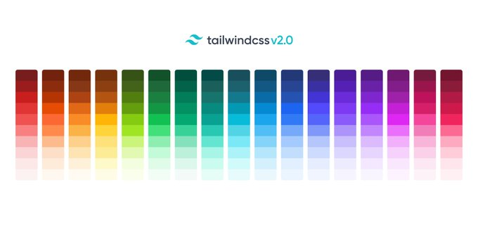

# What's new in TailwindCss v2

Tailwind Css frameworks keeps moving fast and many of the features for v2 are already known. The upgrade looks like it will be easy with a few breaking changes. As the release will probably come in November, we'll try to update the post as new features are announced.

You can start using most of the new features, as they are already deployed in 1.8 behind feature flags.

## Remove deprecated gap utilities

Since v1.7.0, you had available `gap-x-{n}` and `gap-y-{n}` making `col-gap-{n}` and `row-gap-{n}` redundant.

To enable the flag and use the 2.0 behavior, you can use `removeDeprecatedGapUtilities` flag on your project's `tailwind.config.js`:

```jsx
module.exports = {
  future: {
    removeDeprecatedGapUtilities: true,
  },
}
```

## Purge layers by default

The current behavior of the included purgecss only works on the `@utilities` block (it represents the major part of the total build size). In 2.0, it purges utilities from `base`, `components` and `utilities`, so you can expect a smaller build size.

To use the new behavior, add to your `tailwind.config.js` the following snippet:

```jsx
module.exports = {
  future: {
    purgeLayersByDefault: true,
  },

}
```

You can also [configure the layers to be purged](https://tailwindcss.com/docs/upcoming-changes#purge-layers-by-default).

## New Color Scheme

[Steve Schoger](https://twitter.com/steveschoger) is working on a new color palette that expands the current one, but it isn't available yet, so you have to wait until 2.0 release to try it.


