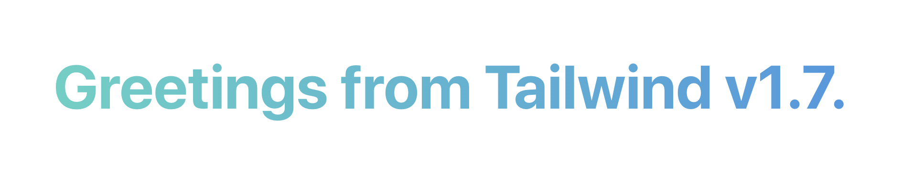

# What is new in Tailwindcss v1.7.0

Say hello to tailwindcss version 1.7.0, this new version comes with awesome new feature and updates, Added Gradients background, @apply with responsive variants, New utilities, and more.

First let's start with new features.

## Gradients

This is the rockstar for this release, Tailwindcss added new utility classes for the background gradients, it's comes with awesome API that lets you specify up to three color stops in one of 8 directions by default:

```html
<div class="bg-gradient-to-r from-orange-400 via-red-500 to-pink-500">
  <!-- ... -->
</div>
```


This is made possible by a new `backgroundImage` core plugin and a new `gradientColorStops` core plugin.

The default configuration for these plugins looks like this:

```jsx
// tailwind.config.js
module.exports = {
  theme: {
    backgroundImage: {
      'gradient-to-t': 'linear-gradient(to top, var(--gradient-color-stops))',
      'gradient-to-tr': 'linear-gradient(to top right, var(--gradient-color-stops))',
      'gradient-to-r': 'linear-gradient(to right, var(--gradient-color-stops))',
      'gradient-to-br': 'linear-gradient(to bottom right, var(--gradient-color-stops))',
      'gradient-to-b': 'linear-gradient(to bottom, var(--gradient-color-stops))',
      'gradient-to-bl': 'linear-gradient(to bottom left, var(--gradient-color-stops))',
      'gradient-to-l': 'linear-gradient(to left, var(--gradient-color-stops))',
      'gradient-to-tl': 'linear-gradient(to top left, var(--gradient-color-stops))',
    },
    gradientColorStops: (theme) => theme('colors'),
  },
  variants: {
    backgroundImage: ['responsive'],
    gradientColorStops: ['responsive', 'hover', 'focus'],
  },
}
```

You can use this new `backgroundImage` plugin for any background images you like.

Example:

```jsx
// tailwind.config.js
module.exports = {
  theme: {
    backgroundImage: {
      'card-image': 'url(https://images.unsplash.com/photo-1593642634315-48f5414c3ad9?ixlib=rb-1.2.1&ixid=eyJhcHBfaWQiOjEyMDd9&auto=format&fit=crop&w=750&q=80)',
      },
  },
}
```

Resualt: 

```css
.bg-card {
  background-image: url(https://images.unsplash.com/photo-1593642634315-48f5414c3ad9?ixlib=rb-1.2.1&ixid=eyJhcHBfaWQiOjEyMDd9&auto=format&fit=crop&w=750&q=80);
}

.sm\:bg-card {
  background-image: url(https://images.unsplash.com/photo-1593642634315-48f5414c3ad9?ixlib=rb-1.2.1&ixid=eyJhcHBfaWQiOjEyMDd9&auto=format&fit=crop&w=750&q=80);
}

.md\:bg-card {
  background-image: url(https://images.unsplash.com/photo-1593642634315-48f5414c3ad9?ixlib=rb-1.2.1&ixid=eyJhcHBfaWQiOjEyMDd9&auto=format&fit=crop&w=750&q=80);
}

.lg\:bg-card {
  background-image: url(https://images.unsplash.com/photo-1593642634315-48f5414c3ad9?ixlib=rb-1.2.1&ixid=eyJhcHBfaWQiOjEyMDd9&auto=format&fit=crop&w=750&q=80);
}

.xl\:bg-card {
  background-image: url(https://images.unsplash.com/photo-1593642634315-48f5414c3ad9?ixlib=rb-1.2.1&ixid=eyJhcHBfaWQiOjEyMDd9&auto=format&fit=crop&w=750&q=80);
}
```

## New background-clip utilities

Also added a new `backgroundClip` core plugin that you can use to control how the background is rendered within an element.

It includes 4 new utilities:

[Untitled](https://www.notion.so/d30b385adbd043daba7b9e0a5df50ad4)

Combined with the new gradient features, you can use this to do cool gradient text stuff like this:

```html
<h1 class="text-6xl font-bold">
  <span class="bg-clip-text text-transparent bg-gradient-to-r from-teal-400 to-blue-500">
    Greetings from Tailwind v1.7.
  </span>
</h1>
```



The `backgroundClip` plugin enabled only responsive variants by default.

```jsx
// tailwind.config.js
module.exports = {
  variants: {
    backgroundClip: ['responsive'],
  },
}
```

## New gap utility aliases

Change `col-gap-{n}` and `row-gap-{n}` utilities with `gap-x-{n}` and `gap-y-{n}` utilities that do the exact same thing with better names.

These utilities will replace the old ones in v2.0, but for now they both exist together.

The recommend migrating to the new names now, and disabling the old names using this feature flag:

```jsx
// tailwind.config.js
module.exports = {
  future: {
    removeDeprecatedGapUtilities: true,
  },
  // ...
}
```

## New contents display utility

Added a new contents class for the recent display: contents CSS feature.

```html
<div class="flex">
  <div><!-- ... --></div>
  <!-- This container will act as a phantom container, and its children will be treated as part of the parent flex container -->
  <div class="contents">
    <div><!-- ... --></div>
    <div><!-- ... --></div>
  </div>
  <div><!-- ... --></div>
</div>
```

# Experimental features

Tailwind v1.7.0 introduces a new experimental feature that is coming to Tailwind soon but isn't quite stable yet.

If you like to try this experimental features, you can enable all of them like so:

```jsx
// tailwind.config.js
module.exports = {
  experimental: 'all',
}
```

Now let's check this new experimental feature.

## Use `@apply` with variants and other complex classes

You can finally use `@apply` with responsive variants, pseudo-class variants, and other complex classes.

```css
.btn {
  @apply bg-indigo hover:bg-indigo-700 sm:text-lg;
}
```

Check the [Add support for `@apply` with complex classes](https://github.com/tailwindlabs/tailwindcss/pull/2159) PR to get more information about this feature.

## New color palette

Added a teaser of the new Tailwind 2.0 color palette that you can start playing with today using the `uniformColorPalette` flag:

```jsx
// tailwind.config.js
module.exports = {
  experimental: {
    uniformColorPalette: true,
  },
}
```

The idea behind the new palette is that every color at every shade has a similar perceived brightness. So you can swap indigo-600 with blue-600 and expect the same color contrast.

## Extended spacing scale

Added a much bigger spacing scale that includes new micro values like `0.5`, `1.5`, `2.5`, and `3.5`, as well as new large values like `72`, `80`, and `96`, and added percentage based fractional values to the whole spacing scale (`1/2`, `5/6`, `7/12`, etc.)

You can enable the extended spacing scale using the `extendedSpacingScale` flag:

```jsx
// tailwind.config.js
module.exports = {
  experimental: {
    extendedSpacingScale: true,
  },
}
```

If you like the new awesome feature check the full [Relased Notes](https://github.com/tailwindlabs/tailwindcss/releases/tag/v1.7.0).

We are waiting for your new components, see you next time.

[Khatab Wedaa](https://twitter.com/khatabwedaa)